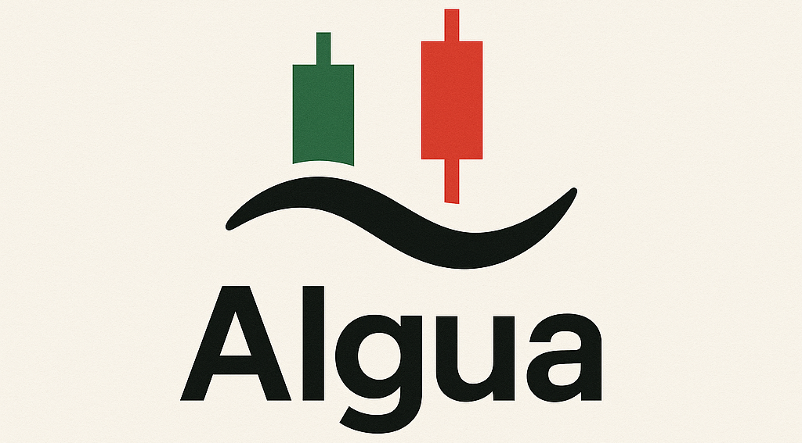

<div align="center">
  
</div>

# Algua - Quantitative Trading Platform

A modern quantitative trading platform built with VectorBT Pro, PyTorch, and FastAPI.

## 🏗️ Architecture

```
algua/
├── api/                    # FastAPI REST API
├── backtesting/           # Backtesting engine & strategies  
├── configs/               # Configuration files
├── dashboards/            # Streamlit dashboard
├── data/                  # Local data storage
├── data_ingestion/        # Data collection & cleaning
├── feature_engineering/   # Feature extraction & selection
├── forward_testing/       # Paper trading & validation
├── live_trading/          # Live execution engine
├── models/                # ML models & strategies
├── notebooks/             # Jupyter notebooks
├── scripts/               # CLI tools & cron jobs
├── tests/                 # Unit & integration tests
└── utils/                 # Shared utilities
```

## 🚀 Quick Start

### 1. Environment Setup
```bash
# Create conda environment
conda env create -f environment.yml
conda activate algua

# Install pre-commit hooks
pre-commit install

# Install system dependencies (Linux/macOS)
# rclone: https://rclone.org/install/
# gsutil: https://cloud.google.com/storage/docs/gsutil_install
```

### 2. Configuration
```bash
# Copy environment template
cp .env.example .env

# Edit with your API keys and settings
vim .env
```

### 3. Run Services
```bash
# Start API server
make api

# Start dashboard (in another terminal)
make dashboard

# Run backtest
make backtest

# Run forward test
make forward
```

### 4. Cron Setup (Live Trading)
Add to your crontab:
```bash
# Run live trading loop every minute (market hours only)
* 9-16 * * 1-5 /path/to/algua/scripts/live_loop.sh >> /var/log/algua.log 2>&1
```

## 📊 Services

- **API**: http://localhost:8000 (FastAPI + docs at /docs)
- **Dashboard**: http://localhost:8501 (Streamlit)
- **Jupyter**: `jupyter lab` (port 8888)

## 🧪 Testing

```bash
# Run all tests
make test

# Run with coverage
make test-cov

# Lint code
make lint
```

## 📦 Key Dependencies

- **VectorBT Pro**: Portfolio optimization & backtesting
- **PyTorch + Lightning**: Deep learning models
- **Optuna**: Hyperparameter optimization  
- **Weights & Biases**: Experiment tracking
- **Alpaca**: Brokerage API (free tier)
- **FastAPI**: REST API framework
- **Streamlit**: Dashboard & visualization

## 🔧 Development

```bash
# Format code
make format

# Type checking
make typecheck

# Run specific test
pytest tests/test_backtesting.py -v
```

## 📝 TODO

- [ ] Implement data ingestion pipelines
- [ ] Build ML feature engineering
- [ ] Create trading strategies
- [ ] Set up monitoring & alerts
- [ ] Add comprehensive logging
- [ ] Implement risk management
- [ ] Build portfolio optimization
- [ ] Add market data caching 