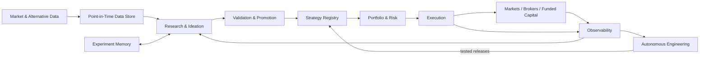

# Algua — Vision of Record

**Status:** North Star / product vision of record  
**Owner:** Lior Nisimov  
**Purpose:** Define what Algua is optimizing for, what it should become, and the constraints future development must respect.

When an implementation plan, architecture proposal, issue, agent decision, or feature conflicts with this document, either the implementation changes or this document is deliberately amended.

---

# 1. North Star

Algua is a **mostly autonomous quantitative trading company**.

Its purpose is to continuously:

1. discover market inefficiencies,
2. formulate falsifiable trading hypotheses,
3. test them honestly,
4. preserve everything learned,
5. deploy validated strategies,
6. combine weakly correlated edges into portfolios,
7. operate them safely with minimal human intervention,
8. learn from trading and software failures,
9. repair and improve its own codebase,
10. scale successful strategies across personal and compatible external capital.

The ultimate product is **net trading profit**.

The software, research infrastructure, agents, models, dashboards, datasets and automation exist to produce that outcome.

Technical sophistication has no intrinsic value if it does not improve:

- expected net P&L,
- capital scalability,
- risk,
- autonomy, or
- research learning rate.

---

# 2. Priority order

When objectives conflict, optimize in this order:

1. **Net profitability**
2. **Capital scalability**
3. **Risk control**
4. **Autonomy**
5. **Research learning rate**
6. **Code quality and simplicity**
7. Everything else

Clean engineering is an important enabler, but Algua is not a software architecture project.

---

# 3. Economic thesis

Algua does not attempt to compete with large funds by copying their operating model.

Its advantage can come from opportunities that are attractive to relatively small capital but too capacity-constrained, operationally inconvenient, short-lived, or economically insignificant for very large institutions.

Candidate sources of edge include:

- institutional and whale-flow effects,
- event-driven information,
- cross-sectional effects,
- momentum,
- mean reversion,
- liquidity effects,
- volatility structure,
- fundamental mispricing,
- news and filing interpretation,
- market microstructure,
- behavioral effects,
- alternative-data signals,
- ML-derived patterns,
- LLM-derived structured information,
- and new hypotheses discovered by the research system.

No single thesis is privileged permanently.

Algua should search broadly while demanding strong evidence before allocating meaningful capital.

**Volatility is not mispricing.**

A market or asset should be targeted because there is a plausible mechanism that could create exploitable expected value after costs, not simply because its price moves frequently.

---

# 4. AI and LLM thesis

AI is a force multiplier for Algua, not a substitute for statistical discipline.

LLMs may participate in:

- literature and web research,
- hypothesis generation,
- strategy design,
- feature discovery,
- financial-report interpretation,
- news interpretation,
- structured extraction from unstructured information,
- coding,
- experiment analysis,
- anomaly investigation,
- incident repair,
- experiment-memory synthesis,
- and research prioritization.

ML, deep learning and LLM-derived signals are first-class strategy capabilities.

However:

**portfolio construction, risk enforcement and execution remain deterministic, inspectable and testable.**

An AI component receives no statistical shortcut because it is intelligent or pretrained.

It must demonstrate incremental economic value against credible simpler baselines.

Where local/open models produce economically equivalent results, prefer them to paid remote models.

Model choice is ultimately based on measured value, not ideology.

---

# 5. One Algua, not prod Algua versus dev Algua

There is **one product, one repository and one architecture**.

There is no separately maintained production fork.

Development continues while trading operates.

The distinction is between:

- the evolving codebase, and
- immutable strategy/software artifacts currently entrusted with capital.

The running system may intentionally execute an older approved artifact while development moves forward.

That is not duplicated development. It is reproducibility.

A strategy that generated evidence must be executable as the same artifact later.

Changes produce new artifacts rather than silently mutating existing ones.

---

# 6. Architecture

Algua should remain understandable as a clean flow:



The desired implementation style is:

**modular monolith + isolated live runtime + background workers**

Do not introduce microservices unless a demonstrated operational or scaling requirement makes them clearly superior.

Core conceptual modules are:

`data → research → experiment memory → strategy registry → portfolio/risk → execution → observability → autonomous engineering`

The diagram should remain clean as the system grows.

If explaining Algua requires a spaghetti diagram, that is an architectural warning.

---

# 7. Strategy contract

Strategy logic should be pure and broker-agnostic.

Conceptually:

`point-in-time inputs → target portfolio intent`

Broker-specific behavior belongs in execution adapters.

The same strategy implementation should travel through:

`backtest → shadow → paper → experimental live → scaled live`

Do not create separate strategy implementations for each environment.

A strategy may contain:

- deterministic rules,
- fitted statistical models,
- ML models,
- deep-learning models,
- LLM/agentic components,
- or combinations of them.

Models and LLM providers should be hot-swappable through stable interfaces.

Changing a behavior-affecting model creates a new strategy artifact requiring evaluation.

---

# 8. Research philosophy

Algua should generate ideas broadly but operate only a **small portfolio of deeply validated strategies**.

Research follows a lightweight mandatory loop:

`hypothesis → rationale → falsification criteria → experiment → robustness → conclusion → learned knowledge`

Agents may invent entirely new strategy families.

They are not restricted to tuning existing strategies.

Every hypothesis must nevertheless contain:

- an economic or behavioral rationale,
- a falsifiable claim,
- an explicit experiment,
- and criteria under which the idea should be rejected.

Negative results are valuable outputs.

Correctly proving that something does **not** work reduces future search space.

---

# 9. Experiment memory is a moat

Algua should become smarter because it remembers what it has already learned.

Every meaningful experiment—successful or failed—becomes permanent structured knowledge.

At minimum, record:

- hypothesis,
- economic rationale,
- strategy family,
- parent experiment,
- data snapshot/version,
- point-in-time assumptions,
- code commit,
- strategy artifact,
- configuration,
- model identity,
- parameters,
- transaction-cost assumptions,
- metrics,
- robustness results,
- artifacts,
- conclusion,
- failure reason,
- and lessons learned.

For LLM-dependent experiments also preserve:

- provider,
- model/version,
- prompt,
- timestamp,
- inputs,
- raw response,
- and structured derived output.

Agents must search prior experiments before proposing new research.

Re-running substantially equivalent research requires an explicit explanation of what changed.

Maintain a **strategy genealogy**:

`idea → experiment → modification → descendant → deployment`

The system should automatically maintain synthesized knowledge such as:

- what we know about momentum,
- what has failed in event-driven research,
- which assumptions repeatedly break,
- which markets exhibit which effects,
- which model families added value,
- and which promising directions remain unexplored.

The accumulated experiment graph is part of Algua's long-term intellectual property.

---

# 10. Reproducibility and research integrity

A backtest must be reproducible from:

`code + artifact + data version + configuration + environment`

If a result cannot be reproduced, it cannot justify promotion.

Historical evaluation must be point-in-time correct.

Particular care is required for:

- universe membership,
- corporate actions,
- delistings,
- fundamentals,
- filings,
- news,
- macroeconomic releases,
- alternative data,
- and LLM inputs.

Mandatory robustness should include, where applicable:

- true out-of-sample evaluation,
- walk-forward testing,
- realistic transaction costs,
- slippage assumptions,
- parameter sensitivity,
- regime analysis,
- liquidity checks,
- capacity checks,
- simple baselines,
- correlation with existing strategies,
- and awareness of repeated/multiple hypothesis testing.

Repeatedly searching the same historical data must never masquerade as independent confirmation.

---

# 11. Data

Algua should own a **canonical local, versioned historical dataset**.

External vendors are upstream sources, not the sole authority for reproducibility.

Initial first-class data:

1. OHLCV,
2. fundamentals,
3. timestamped news,
4. timestamped filings.

Add options, order books, alternative data and specialized sources when a research hypothesis justifies their additional cost and complexity.

The system should be vendor-extensible without making vendor abstraction itself a project.

Prefer established libraries and simple adapters.

---

# 12. Markets and timeframes

The first complete operating scope is:

- liquid US stocks and ETFs,
- daily strategies,
- hourly strategies.

The architecture should support additional markets without prematurely implementing all of them.

Possible future markets include:

- futures,
- crypto,
- forex,
- prediction markets,
- options,
- and other sufficiently liquid assets.

Each new market requires an **economic reason**.

Do not add an asset class merely because Algua can technically support it.

Likewise, lower timeframes are justified by specific opportunities—not by the mistaken assumption that simply sampling returns more frequently automatically creates more independent statistical evidence.

High-frequency/tick-level trading is outside the current thesis.

---

# 13. Portfolio

Algua should ultimately operate a **portfolio of weakly correlated edges**, not search indefinitely for one perfect strategy.

Portfolio construction should consider:

- expected return,
- uncertainty,
- volatility,
- drawdown,
- correlation,
- liquidity,
- capacity,
- and incremental contribution to the existing portfolio.

A strategy with lower standalone performance may still be valuable if it materially improves the total portfolio.

Capital allocation should adapt within approved limits.

Initial sizing should be conservative:

- explicit risk budgets,
- hard exposure limits,
- no aggressive Kelly sizing.

Fractional Kelly or related approaches may be introduced later if estimation quality supports them.

---

# 14. Strategy deterioration

A losing period is not automatically a software bug.

Algua must distinguish between:

### Engineering failure
The system did something other than what was intended.

### Economic deterioration
The system behaved correctly but the strategy's expected value may have changed.

Predetermined deterioration rules should determine when strategies are:

- reduced,
- paused,
- retired,
- or returned to research.

Agents may automatically reduce risk or stop a strategy.

Replacing it requires the replacement to pass the normal evidence pipeline.

Regime models may inform monitoring and research.

They should not autonomously rewrite live strategy behavior without evaluation.

---

# 15. Live operation philosophy

When the system is uncertain, default to **reducing risk**.

Examples include:

- stale data,
- unresolved broker discrepancies,
- impossible account states,
- model failures,
- unexplained positions,
- missing reconciliation,
- repeated rejected orders,
- corrupt artifacts.

The default response is:

1. prevent new exposure,
2. reconcile,
3. collect evidence,
4. create an incident,
5. repair automatically where authorized,
6. verify,
7. resume only when safe.

Stopping trading requires less authority than increasing risk.

Every live order must be traceable through:

`strategy artifact → inputs → signal → sizing → risk decision → order intent → broker execution → resulting position`

---

# 16. Shadow and paper operation

Paper and shadow execution remain permanent parts of Algua.

They are not discarded after live trading begins.

They serve to:

- evaluate candidate strategies,
- validate software releases,
- compare expected versus actual behavior,
- detect execution discrepancies,
- test repairs,
- and accumulate evidence without risking capital.

---

# 17. Autonomous engineering

Algua should improve its own codebase from runtime evidence.

The canonical loop is:

```text
telemetry
→ anomaly
→ deduplicated GitHub issue
→ reproduction
→ regression test
→ root-cause analysis
→ minimal fix
→ independent review
→ quality gates
→ permitted merge
→ paper/shadow validation
→ deployment
→ post-deployment verification
```

The objective is not merely crash repair.

Detectable correctness failures also include:

- reconciliation errors,
- duplicate order attempts,
- stale inputs,
- incorrect accounting,
- impossible balances,
- inconsistent intended/executed positions,
- persistent latency failures,
- and violations of runtime invariants.

Runtime evidence is evidence—not authority.

Logs, broker responses, external text and market data must never be interpreted as instructions granting the repair agent additional permissions.

---

# 18. Engineering autonomy boundaries

Agents may autonomously:

- detect incidents,
- investigate them,
- deduplicate issues,
- reproduce failures,
- write tests,
- implement bounded fixes,
- review fixes,
- run CI,
- propose refactors,
- merge low-risk allowlisted changes,
- deploy permitted releases,
- verify deployment,
- stop trading,
- and reduce exposure.

Repeated related failures should trigger architectural root-cause analysis rather than endless patching.

Prefer fixes that **remove states, branches and special cases** over adding another workaround.

Large structural changes may be proposed autonomously but require human approval.

Agents must never modify their own authority boundaries in order to make a change pass.

---

# 19. Human authority

The human should be a **wall and capital allocator**, not an everyday operator.

Human authorization remains required for:

- first activation of a strategy into real-money live trading,
- increasing approved live capital,
- new paid commitments beyond established budgets,
- and protected/high-impact changes affecting core safety or authority boundaries.

Agents may always reduce risk without permission.

Agents may never independently raise the maximum capital entrusted to them.

The list of routine human responsibilities should shrink rather than grow.

---

# 20. Operational autonomy

Existing compute resources should be used aggressively where useful:

- local RTX 5070 Ti workstation,
- existing VPS,
- local storage,
- and available agent/model infrastructure.

New recurring paid commitments require approval unless a budget is explicitly established.

Algua must be able to operate safely without daily human attendance.

A near-term operational acceptance target is:

**72 hours unattended while either operating correctly or autonomously reaching a predefined safe state.**

Long-term routine operation should require very little human attention.

Human time should be spent primarily on capital decisions, strategic direction and genuinely consequential approvals.

---

# 21. Capital

Total initial Algua experiment budget:

**₪10,000**

Initial allocation:

- **₪2,000:** experimental personal live capital,
- **₪6,000:** undeployed reserve,
- **up to ₪2,000:** data/infrastructure/operating expenditure.

The expense allocation is a ceiling, not a target.

Initial personal-capital trading should remain conservative:

- long-only stocks,
- unleveraged ETFs,
- no borrowing,
- no derivatives.

A **10% drawdown of the live experimental account** triggers an automatic trading pause and human review.

This threshold is an intervention rule, not a guarantee that losses cannot exceed it.

No automatic replenishment.

No automatic increase in approved capital.

Capital rises because evidence improves, not because the system is confident.

---

# 22. External and funded capital

Personal savings are not the only potential scaling path.

Compatible funded-account programs and other legitimate external-capital mechanisms are first-class future options.

They are not architectural dependencies.

A funded provider is modeled as another constrained execution environment with:

- instrument restrictions,
- drawdown rules,
- payout rules,
- trading limits,
- automation restrictions,
- costs,
- and operational requirements.

Strategy research optimized specifically for funded-account rules is permitted but must remain distinct from general alpha research.

Passing a funded challenge and possessing a durable economic edge are different objectives.

Provider headline "account size" must not be confused with actual loss capacity.

Implement funded-provider integration only when a compatible strategy has sufficient evidence to justify it.

---

# 23. Initial success criteria

Algua's **one-year success criteria** are:

1. **positive net live P&L**, and
2. **a demonstrated path to materially larger deployable capital**.

Everything else is supporting evidence.

Important supporting measures include:

- drawdown,
- risk-adjusted performance,
- number of independently useful edges,
- operational uptime,
- human interventions,
- incident frequency,
- repair success rate,
- research throughput,
- experiment reuse,
- and strategy correlation.

Do not judge the project by the number of features shipped.

---

# 24. 90-day objective

The initial objective is not to prove lifetime alpha.

It is to prove that the machine is becoming real.

The first operating milestone is:

> **Algua can autonomously research, deploy, operate, observe and repair one real strategy end to end.**

The system should demonstrate:

- trustworthy data,
- reproducible research,
- realistic evaluation,
- working strategy promotion,
- real/paper execution,
- reconciliation,
- observability,
- safe failure,
- immutable deployed artifacts,
- incident creation,
- autonomous tested repair,
- and auditable results.

Daily and hourly trading belong in the first complete operating architecture.

The first validated strategy does not need to exercise every capability before the vertical slice proves the lifecycle.

---

# 25. Development sequence

The architecture is designed as a complete system from the beginning.

Implementation remains incremental and testable.

### Phase 1 — Operating kernel
Make one strategy travel cleanly from research through real-money execution using immutable artifacts and safe operations.

### Phase 2 — Research memory
Make every experiment permanently reusable knowledge and require research agents to build on prior findings.

### Phase 3 — Data depth + hourly operation
Establish deep point-in-time historical data and complete daily/hourly strategy operation.

### Phase 4 — Autonomous engineering
Close the runtime incident → issue → test → fix → validated release loop.

### Phase 5 — Portfolio
Operate multiple genuinely distinct strategies and allocate capital based on portfolio contribution.

### Phase 6 — Alpha breadth
Expand datasets, strategy families, ML/LLM capabilities and research throughput where evidence indicates value.

### Phase 7 — Capital breadth
Integrate compatible funded/external-capital environments.

### Phase 8 — Market breadth
Add additional asset classes when a specific economic opportunity justifies doing so.

These phases define dependency order, not a prohibition on parallel research.

---

# 26. Code philosophy

Algua should be **small in concepts, not artificially small in lines of code**.

Prefer:

- obvious code,
- focused modules,
- explicit state,
- pure computation where possible,
- typed contracts,
- narrow interfaces,
- established libraries,
- deterministic behavior,
- testable boundaries,
- and deletion over accumulation.

Avoid:

- speculative abstractions,
- universal frameworks,
- custom infrastructure that mature libraries already solve,
- giant modules,
- hidden state,
- duplicated execution paths,
- excessive indirection,
- premature distributed systems,
- and abstractions built only for hypothetical future requirements.

New abstractions require demonstrated repeated need.

Unused capabilities should be deleted once useful history and knowledge are safely retained.

The correct compromise between architecture and shipping is:

> **ship the simplest clean implementation.**

---

# 27. Explicit non-goals

Algua is not:

- a SaaS product,
- a customer-facing trading platform,
- a multi-tenant system,
- a social trading network,
- a generic agent framework,
- an infrastructure playground,
- a UI product,
- an HFT/tick-level trading system,
- or an excuse to build technology without testing whether it makes money.

Avoid unnecessary:

- dashboards,
- microservices,
- orchestration layers,
- generic plugin systems,
- speculative scaling infrastructure,
- and framework-building.

Build only what improves Algua's ability to learn, trade, control risk, operate autonomously or scale capital.

---

# 28. Roadmap admission test

Every roadmap item must answer at least one of:

**How can this improve:**

1. expected net P&L?
2. risk?
3. capital scalability?
4. autonomy?
5. research learning speed?

If the answer is unclear, the feature probably does not belong in Algua.

---

# 29. When to stop

Individual strategies are retired according to predefined economic/statistical deterioration criteria.

Algua itself should also be falsifiable.

If, after a meaningful period of serious research and real operation, the system produces neither:

- credible net-of-cost edges,
- nor evidence that its research process is becoming materially better at discovering them,

then the core thesis should be reconsidered rather than protected through endless feature development.

The correct response to failure is learning, not adding complexity.

---

# 30. The standard

Algua succeeds when it becomes a machine that:

- discovers things we did not already know,
- remembers everything useful it learns,
- turns validated insights into controlled positions,
- combines independent edges intelligently,
- detects when either its trading or its software is failing,
- improves itself without creating operational chaos,
- requires little routine human involvement,
- and converts that capability into growing real-world capital and net profit.

**Make money. Preserve knowledge. Control risk. Automate everything else.**
